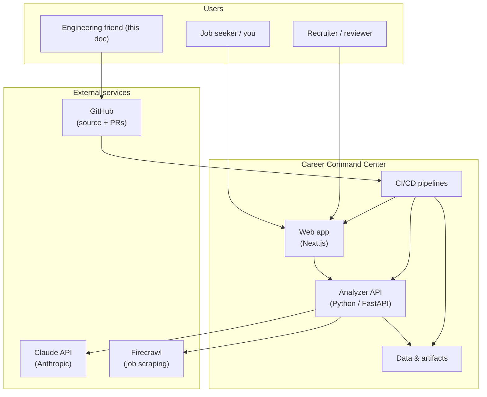
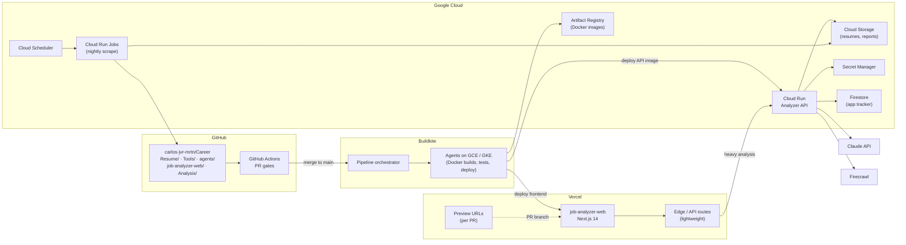
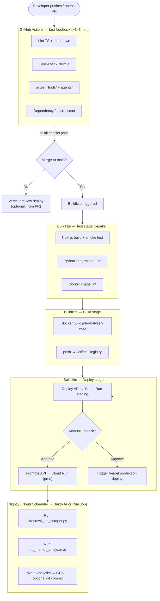
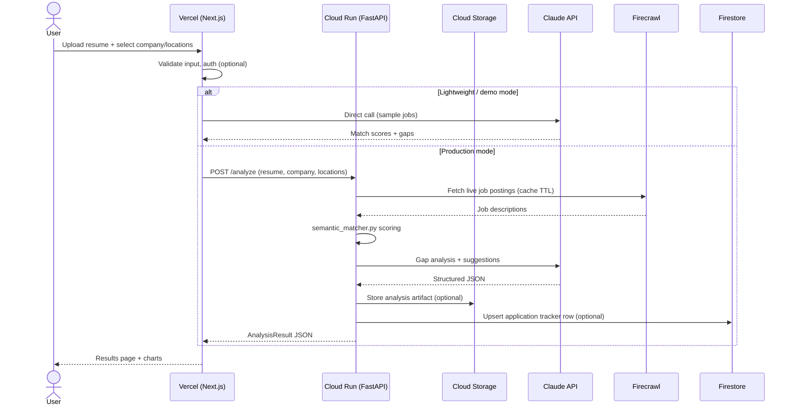
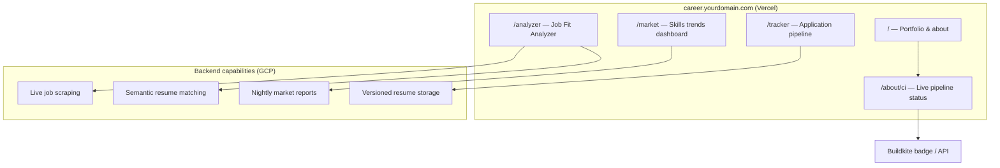
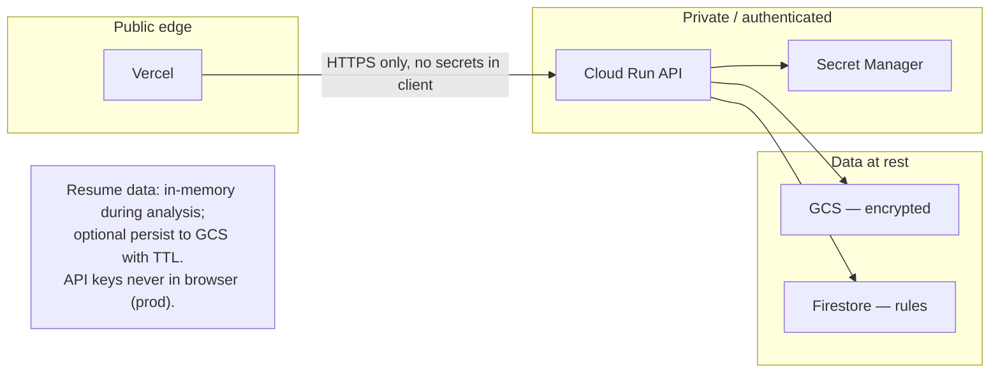

# Career Command Center — Architecture Overview

> **Purpose:** Shareable architecture for review. This doc describes how GitHub Actions, Buildkite, Vercel, and Google Cloud work together to power a career portfolio + AI job-fit platform.
>
> **Feedback welcome on:** service boundaries, over-engineering, security, cost, and whether this tells a credible CI/CD story.

---

## 1. System context (who talks to what)



---

## 2. Deployment topology (where things run)



---

## 3. CI/CD pipeline (the Harness-CI-style story)



---

## 4. Request flow — “Analyze my resume”



---

## 5. Product surfaces (what users see)



---

## 6. Component responsibilities

| Layer | Tool | Responsibility | Runs when |
|-------|------|----------------|-----------|
| Source | **GitHub** | Repo, PRs, code review | Always |
| PR gates | **GitHub Actions** | Lint, type-check, unit tests, security | Every push / PR |
| Orchestration | **Buildkite** | Multi-stage pipelines, Docker builds, deploys, nightly jobs | Merge to main + schedule |
| Frontend | **Vercel** | Next.js UI, previews, edge routes | Every request |
| API | **GCP Cloud Run** | Python analyzers, scraping, Claude orchestration | On demand |
| Batch | **GCP Cloud Run Jobs** | Nightly scrape + analyze | Cron (e.g. 2am PT) |
| Storage | **GCS** | Resumes, JSON/Markdown reports | On write |
| Secrets | **Secret Manager** | Claude, Firecrawl keys | On API start |
| Tracker | **Firestore** | Application stages, notes | On user action |
| Images | **Artifact Registry** | Container images from Buildkite | On build |

---

## 7. Repo → service mapping (today → target)

| Repo path | Today | Target home |
|-----------|-------|-------------|
| `job-analyzer-web/` | Local dev | **Vercel** (production + previews) |
| `Tools/*.py`, `agents/` | CLI / scripts | **Cloud Run** (FastAPI wrapper) |
| `Analysis/` | Committed markdown/JSON | **GCS** (+ optional git sync) |
| `Resume/` | Static files in repo | **GCS** (versioned) + links from Vercel |
| _(static portfolio page)_ | Static portfolio | Merged into Next.js `/` |
| `Dockerfile` | Local compose | Built by **Buildkite** → **Artifact Registry** → **Cloud Run** |

---

## 8. Security & data boundaries



**Key decisions for review:**
- Client-side Claude API key (current demo) vs server-side only (production)
- Whether to persist resumes or keep ephemeral-only
- Firestore vs flat files in GCS for application tracker
- Public `/about/ci` page exposing Buildkite pipeline metadata

---

## 9. Cost & complexity (honest take)

| Phase | Stack | Monthly ballpark | Complexity |
|-------|-------|------------------|------------|
| **MVP** | Vercel + GitHub Actions only | $0–20 | Low |
| **Phase 2** | + Cloud Run API + Secret Manager | $5–30 | Medium |
| **Full** | + Buildkite + Scheduler + GCS + Firestore | $30–100+ | High |

**Recommendation:** Ship Vercel + GitHub Actions first. Add Buildkite when you want the CI/CD portfolio story. Add GCP when live scraping replaces hardcoded sample jobs.

---

## 10. Questions for reviewers

1. **Boundaries:** Should the Next.js `/api/analyze` route stay on Vercel, or should all analysis move to Cloud Run immediately?
2. **Buildkite vs Actions:** Is Buildkite overkill if GitHub Actions can build Docker and deploy to Cloud Run? (Tradeoff: Buildkite is better for complex pipelines + your PM narrative.)
3. **Data:** Ephemeral resume processing only, or versioned storage in GCS?
4. **Nightly jobs:** Buildkite scheduled pipeline vs Cloud Scheduler → Cloud Run Job — preference?
5. **Scope:** Which product surface is highest value — Analyzer, Tracker, or Market dashboard?
6. **Security:** Anything alarming about the Claude/Firecrawl integration pattern?

---

## 11. One-page summary (copy/paste for Slack)

```
Career Command Center
─────────────────────
GitHub repo → GitHub Actions (PR lint/test) → Buildkite (build/deploy)
                                                    ├→ Vercel (Next.js UI)
                                                    └→ GCP Cloud Run (Python API)
                                                           ├→ Claude + Firecrawl
                                                           ├→ GCS (artifacts)
                                                           └→ Firestore (tracker)

Nightly: Cloud Scheduler → scrape jobs → update Analysis/ + market dashboard
Public site: portfolio + job analyzer + application tracker + live CI status page
```

---

*Generated from the Career repo architecture proposal. Render mermaid diagrams on GitHub or at [mermaid.live](https://mermaid.live).*
